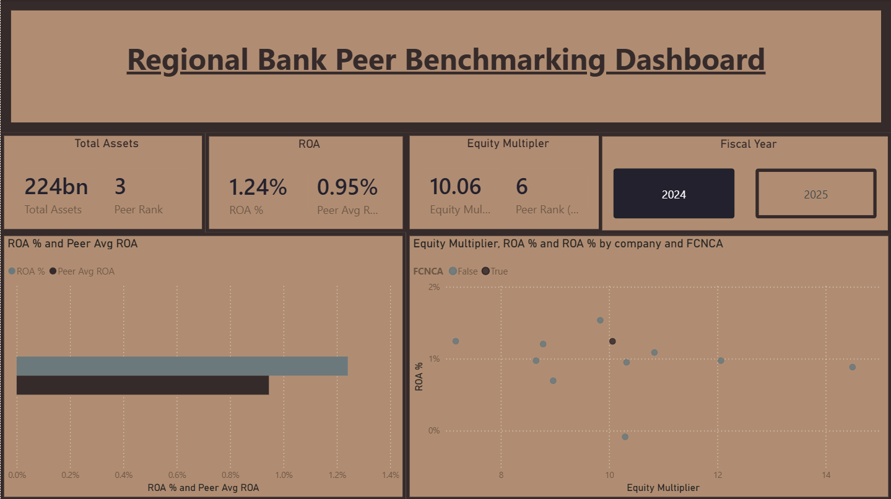
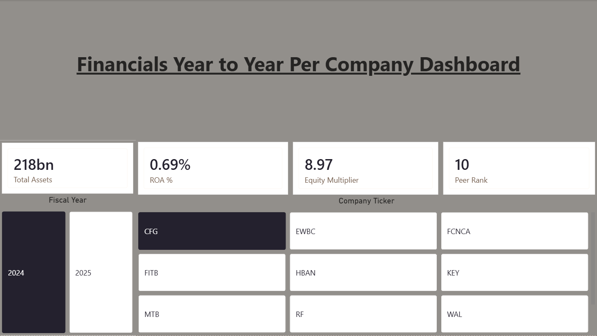
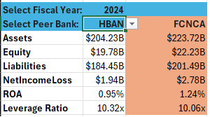
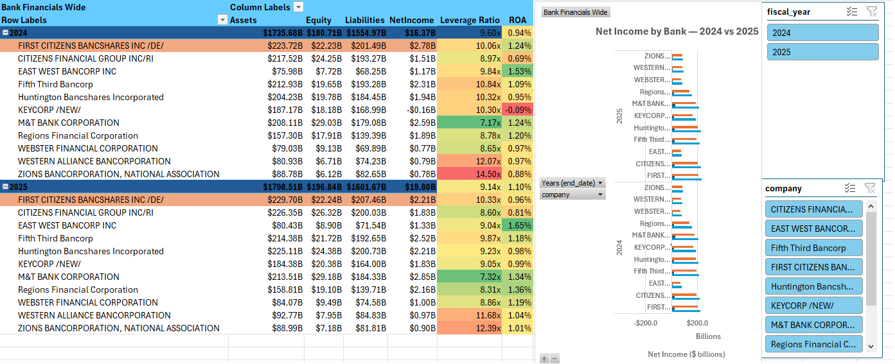

# Regional Bank Peer Benchmarking Dashboard

**One bank in an eleven-bank peer group got worse in 2025. Every other bank got better.**

**Author:** Robert W Cellucci
**Stack:** Python 3 · SEC EDGAR XBRL REST API · Power BI (DAX, Power Query) · Excel
**Subject:** First Citizens BancShares (FCNCA) · **Peers:** MTB, FITB, HBAN, RF, KEY, CFG, ZION, WAL, EWBC, WBS

---

## The Finding

Between FY2024 and FY2025, **First Citizens BancShares was the only bank in its peer group whose return on assets declined.** ROA fell 28 basis points, from 1.24% to 0.96%. All ten peers improved.

The ranking consequence is severe. FCNCA entered 2024 as the **3rd most profitable bank of eleven** by ROA and exited 2025 as the **10th of eleven**. It did not lose ground because the peer set stood still — it lost ground because the peer set moved and FCNCA moved the other way.

| Bank | FY2024 ROA | FY2025 ROA | Change |
|---|---:|---:|---:|
| KEY | −0.09% | 0.99% | **+108 bp** |
| WBS | 0.97% | 1.19% | +22 bp |
| RF | 1.20% | 1.36% | +15 bp |
| ZION | 0.88% | 1.01% | +13 bp |
| CFG | 0.69% | 0.81% | +12 bp |
| EWBC | 1.53% | 1.65% | +11 bp |
| MTB | 1.24% | 1.34% | +9 bp |
| FITB | 1.09% | 1.18% | +9 bp |
| WAL | 0.97% | 1.04% | +7 bp |
| HBAN | 0.95% | 0.98% | +3 bp |
| **FCNCA** | **1.24%** | **0.96%** | **−28 bp** |

*(KeyCorp's outlier gain is not organic operating improvement — it reflects recovery from a FY2024 net loss of −$161M tied to securities repositioning. It is included for completeness, but the finding does not depend on it: nine of the remaining ten peers still improved.)*

### The second half of the finding

The profitability decline did not come with a matching reduction in balance-sheet risk. It came with the opposite.

| Metric | FCNCA FY2024 | FCNCA FY2025 |
|---|---:|---:|
| Equity multiplier (Assets / Equity) | 10.06x | 10.33x |
| Peer group mean equity multiplier | 10.14x | 9.52x |
| FCNCA leverage rank (1 = most levered) | 6th of 11 | 3rd of 11 |

The peer group **deleveraged** through 2025 — mean equity multiplier fell 0.62x. FCNCA levered up slightly. So over a single fiscal year, FCNCA moved from the middle of the pack on leverage to the third most levered bank in the group, while simultaneously falling from third to tenth on returns.

**Returns down, relative leverage up.** That is the quadrant a credit analyst screens for, and it is visible in twelve months of two balance-sheet line items and one income-statement line item.

The cross-sectional relationship supports the same reading: leverage and ROA are negatively correlated across the peer group in both years (r = −0.18 in FY2024, r = −0.36 in FY2025). In this sample, leverage is not buying returns.

---

## Dashboards

### Power BI — Core Dashboard

The subject-versus-peers view. KPI cards report FCNCA's absolute metric alongside its position in the peer distribution, so a single glance answers both "what is it" and "is that good."



The scatter on the right plots equity multiplier against ROA for all eleven banks, with FCNCA isolated by the `is_subject` flag (dark marker). This is the visual that carries the finding: FCNCA sits right of center on leverage without a corresponding position on returns.

### Power BI — Year to Year Financials

The same measures re-pointed at a single-company drill, so any peer can be inspected on the same basis rather than only in aggregate.



Shown here: Citizens Financial Group (CFG), FY2024 — 0.69% ROA, peer rank 10 of 11. The peer rank measure responds to the slicer selection rather than being hardcoded to the subject bank, which is what makes the page reusable across all eleven tickers.

### Excel — Head-to-Head Scorecard

A two-column comparison that pits FCNCA against any peer selected from a dropdown, for any fiscal year.



### Excel — Interactive Wide Table

The full peer set, both years, with computed ratio columns, conditional formatting, slicers, and a year-over-year net income comparison chart.



---

## Repository Structure

```
├── pull_bank_financials.py        # SEC EDGAR XBRL extraction pipeline
├── source/bank_financials_long.csv # Pipeline output — 88 rows, tidy long format 
├── Book1.xlsx                     # Excel layer: Scorecard, wide pivot, source table
├── Regional_Bank_Peer_Benchmarking_Dashboard.pbix
└── images/                        # Dashboard screenshots used in this README
```

---

## The Data Pipeline

`pull_bank_financials.py` pulls four concepts — Assets, Liabilities, Equity, and Net Income — for eleven tickers across the two most recent fiscal years, directly from the SEC's XBRL `companyfacts` REST API. It resolves each ticker to a zero-padded 10-digit CIK, requests the full facts payload, and filters down to annual figures.

The interesting engineering is in the filtering, because raw XBRL is not clean.

### Problem 1: Companies do not all use the same tag

There is no single universal tag for "shareholders' equity." Filers choose between `StockholdersEquity` and `StockholdersEquityIncludingPortionAttributableToNoncontrollingInterest` depending on their corporate structure. Net income has at least three plausible tags.

The script defines an **ordered fallback list** per concept and merges lowest-priority first, so higher-priority tags overwrite:

```python
CONCEPT_TAGS = {
    "Assets":      ["Assets"],
    "Liabilities": ["Liabilities"],
    "Equity":      ["StockholdersEquityIncludingPortionAttributableToNoncontrollingInterest",
                    "StockholdersEquity"],
    "NetIncome":   ["NetIncomeLoss", "ProfitLoss",
                    "NetIncomeLossAvailableToCommonStockholdersBasic"],
}
```

This achieves 100% coverage — 88 of 88 expected company-year-concept cells populated, zero gaps. It also introduces a documented tradeoff, discussed under Limitations.

### Problem 2: The same fiscal year appears more than once

A 10-K reports both the current year and the prior year as a comparative. Restatements and amended filings add further duplicates. Pulling naively yields multiple conflicting values for the same period.

Two deduplication passes handle this. `deduplicate_by_end_date` keeps only the **most recently filed** value for each distinct period end, so restatements win over originals. `deduplicate_same_year` then guards against fiscal-year changes and stub periods by keeping the latest `end_date`, tie-broken by filing date.

### Problem 3: Annual versus quarterly windows

Duration-type facts carry start and end dates. `is_annual_window` computes the span and keeps only periods of 350–380 days, which excludes quarterly and transition-period facts that would otherwise contaminate the net income series.

### Problem 4: Missing liabilities

Some filers omit a total `Liabilities` tag entirely. When Assets and Equity are both present, `add_derived_liabilities` computes the difference and writes it with `source_tag = "derived_Assets_minus_Equity"` — **flagged in the output**, not silently imputed. Any downstream consumer can filter derived values out.

### Validation: the balance sheet has to balance

Before writing the CSV, `sanity_check` verifies **Assets = Liabilities + Equity** for every company-year and prints any discrepancy over 1%.

```
FCNCA FY2024: Assets=223,720,000,000 vs L+E=223,720,000,000 (diff 0.00%)
```

Across all 22 company-years the maximum observed discrepancy is **6.2 × 10⁻⁶** (0.0006%), attributable to rounding at the reporting-unit level. This is the check that catches a bad pull before it reaches Power BI, where a wrong number looks exactly as authoritative as a right one.

---

## Power BI Model

A two-table star schema rather than a flat import, which is what makes the peer-relative measures possible.

| Table | Role | Key columns |
|---|---|---|
| `DIM_Company` | Dimension | `company`, `ticker`, `is_subject` |
| `Facts` | Fact table | `fiscal_year`, concept values |

The `is_subject` boolean flag on the dimension is the design decision that does the most work. It lets a single measure compute a peer average that **excludes the subject bank**, rather than comparing FCNCA against an average that FCNCA is inside of. Verified: the dashboard's FY2024 peer average of 0.95% matches the mean of the ten non-FCNCA banks (0.945%), not the eleven-bank mean (0.972%).

### Measures

| Measure | Purpose |
|---|---|
| `Total Assets` | Subject bank asset base |
| `ROA %` | Net income ÷ assets |
| `Equity Multiplier` | Assets ÷ equity |
| `Peer Avg ROA` | Mean ROA across peers, subject excluded |
| `Peer Rank` | Descending rank on ROA % within the fiscal year |
| `Peer Rank (Equity Multiplier)` | Descending rank on leverage within the fiscal year |

Ranks are computed within the fiscal-year filter context, so switching the year slicer re-ranks the entire group rather than returning a stale ordering.

---

## Excel Layer

The Excel workbook is deliberately built on the same long-format CSV, not a pre-pivoted extract, so the lookup logic has to do real work.

| Sheet | Purpose |
|---|---|
| **Scorecard** | Head-to-head comparison: selected peer versus FCNCA for a selected fiscal year |
| **bank_financials_wide_full** | Pivot of the full peer set with computed ratio columns, slicers, and charts |
| **bank_financials_long** | The pipeline output as an Excel Table — the single source both sheets read from |

### Three-condition lookup without a helper column

Pulling one value out of tidy long data requires matching on ticker **and** fiscal year **and** concept simultaneously. Standard `VLOOKUP` and `XLOOKUP` handle one criterion. The Scorecard uses boolean multiplication inside `MATCH` to build a composite key on the fly:

```excel
=INDEX(bank_financials_long[value],
   MATCH(1,
     (bank_financials_long[ticker]      = B$3) *
     (bank_financials_long[fiscal_year] = $B$2) *
     (bank_financials_long[concept]     = IF($A4="NetIncomeLoss","NetIncome",$A4)),
   0))
```

Each comparison returns a TRUE/FALSE array; multiplying them coerces to 1/0 and yields 1 only on the row satisfying all three conditions. The nested `IF` reconciles the display label (`NetIncomeLoss`, the XBRL tag name) with the stored concept value (`NetIncome`) so the row labels can stay filing-accurate without breaking the match.

The peer ticker in `B3` is driven by a data-validation dropdown and the fiscal year in `B2` by a second selector, so the entire scorecard — including derived ROA and leverage ratio — recalculates on a single cell change.

### Wide table

The pivot carries `IFERROR`-wrapped ratio columns (`=IFERROR(B6/C6,"")`) so that a missing denominator produces a blank rather than `#DIV/0!` polluting the conditional formatting scale. Slicers on `fiscal_year` and `company` filter both the table and the linked net income chart together.

---

## Limitations

Stated plainly, because each one bounds what the finding can claim.

**ROA uses year-end assets, not average assets.** Standard practice is to divide net income by *average* assets over the period, since income is earned across the year while the balance sheet is a point-in-time snapshot. This dashboard uses period-end assets. For a bank growing assets, that understates ROA slightly. The bias is consistent across all eleven banks and both years, so relative comparisons and rank orderings hold — but the absolute ROA figures are not directly comparable to a bank's published ROA.

**Four banks resolve to an NCI-inclusive equity tag.** HBAN, RF, WAL, and WBS report equity under `StockholdersEquityIncludingPortionAttributableToNoncontrollingInterest`; the other seven use `StockholdersEquity`. Each bank is internally consistent across both years, so year-over-year comparisons within a bank are sound. Cross-sectional equity multiplier comparisons carry a small definitional inconsistency, biasing those four banks' multipliers marginally downward. FCNCA uses the plain tag, so the leverage finding is not an artifact of this.

**FY2024 figures are comparative-period restatements.** All 88 rows come from a single accession per ticker — the FY2025 10-K. FY2024 values are the prior-year comparatives as restated in that filing, not the figures originally published in the FY2024 10-K. This is the correct choice for consistency, but it is not "what the market saw in early 2025."

**No income-statement decomposition.** The pipeline pulls net income as a single line. It can establish *that* FCNCA's returns fell while peers' rose; it cannot establish *why*. Net interest margin compression, credit provisioning, non-interest expense, and one-time items are all candidate drivers, and separating them would require pulling the full income statement.

**Small sample, short window.** Eleven banks, two fiscal years. The negative leverage-to-ROA correlation (r = −0.18 and −0.36) is directionally consistent with the broader 242-bank sample in the companion [Bank Leverage & Efficiency Dashboard](https://github.com/robertwcellucci/bank-leverage-efficiency-dashboard) project (r = −0.30), but at n = 11 it is not independently significant.

---

## Reproducing

```bash
pip install requests
python3 pull_bank_financials.py
```

The SEC requires a descriptive `User-Agent` header identifying the requester and a contact method; requests without one are throttled or blocked. Update `HEADERS` in the script before running. The script sleeps 0.2s between tickers to stay under the SEC's rate limit.

Output is written to `bank_financials_long.csv`. Both the Excel workbook and the Power BI model read from that file — refresh the Power Query connection and the workbook's source table to update the dashboards.

To retarget the analysis at a different subject bank, change `SUBJECT` and `PEERS` at the top of the script, then update the `is_subject` flag in `DIM_Company`.

---

## Data Source

U.S. Securities and Exchange Commission, XBRL `companyfacts` API — `https://data.sec.gov/api/xbrl/companyfacts/CIK##########.json`. Form types restricted to 10-K and 10-K/A. All figures as filed; no manual adjustments.
